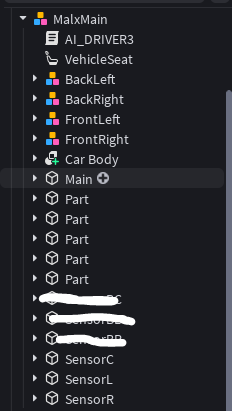

# 🚗 Autonomous Roblox Car

> An intelligent autonomous vehicle controller for Roblox with advanced sensor fusion, multi-stage threat detection, and adaptive driving behavior.



## Overview

A sophisticated Luau-based autonomous driving system featuring:
- **Dual-sensor lane detection** with ray-based lane keeping
- **LIDAR-based obstacle avoidance** with sector-based free-space selection
- **Intelligent sensor fusion** that balances lane guidance and obstacle avoidance
- **Pedestrian detection & behavior** with yield/avoid logic
- **Dynamic speed scaling** based on threats and road curvature
- **Predictive collision detection** using time-to-collision (TTC) analysis

## Key Features

### 🛣️ Lane Keeping
- **Dual ray sensors** (Left/Right) with 35-beam detection per side
- **Closest edge detection** to prevent drifting toward lane boundaries
- **Pressure-based steering** that increases as the vehicle approaches edges
- **Adaptive smoothing** that adjusts responsiveness based on road curves

### 🚧 Obstacle Avoidance
- **LIDAR sensor** (SensorC) with 27-beam spread pattern (55-stud range)
- **Sector-based free-space selection** for stable avoidance paths
- **Multi-stage threat assessment** with 5 threat levels:
  - `NONE` - Clear road
  - `MONITOR` - Tracking distant obstacle
  - `CAUTION` - Pre-emptive adjustment
  - `WARNING` - Active avoidance
  - `CRITICAL` - Emergency maneuver

### 🚶 Pedestrian Handling
- **Real-time pedestrian detection** from LIDAR hits
- **Movement analysis** to distinguish stationary vs. moving pedestrians
- **Yield behavior** - Stops for moving pedestrians within 30 studs
- **Avoidance behavior** - Steers around stationary pedestrians within 38 studs
- **Post-avoidance stabilization** with heading hold

### 📊 Threat Detection
- **Distance-based thresholds** across 4 zones (Critical, Warning, Caution, Monitor)
- **Time-to-Collision (TTC)** calculation for lead vehicles
- **Closing velocity estimation** using frame-to-frame distance delta
- **Lateral threat awareness** considering obstacle position relative to path
- **Semantic classification** of obstacles (Vehicle, Pedestrian, Barrier, etc.)

### ⚙️ Intelligent Fusion
- **Adaptive weight scheduling** based on threat level:
  - At `CRITICAL`: 85% obstacle weight, 15% lane weight
  - At `NONE`: 100% lane weight, 0% obstacle weight
- **Conflict detection** to prevent steering into obstacles
- **Smooth transition** between driving modes without oscillation

### 🎯 Additional Capabilities
- **Heading hold** - Stabilizes vehicle heading after maneuvers (3.5s)
- **Speed scaling** - Reduces speed by ~45% on curves
- **Traffic following** - Maintains gap behind lead vehicles
- **Blocked-path detection** - Stops if surrounded by obstacles
- **Visual feedback** system (colored beams) for debugging

## Configuration

The system is highly tunable via the `CONFIG` table in the controller:

| Category | Key Parameters |
|----------|-----------------|
| **Lane Detection** | `LANE_RAY_LENGTH`, `LANE_DETECTION_RAYS`, `LANE_SCAN_HALF_ANGLE` |
| **LIDAR** | `LIDAR_RANGE`, `LIDAR_SPREAD_HALF_ANGLE`, `LIDAR_BEAM_COUNT` |
| **Threat Zones** | `THREAT_ZONE_CRITICAL`, `THREAT_ZONE_WARNING`, `THREAT_ZONE_CAUTION`, `THREAT_ZONE_MONITOR` |
| **Timing** | `TTC_CRITICAL`, `TTC_WARNING`, `TTC_CAUTION`, `HEADING_HOLD_TIME` |
| **Steering** | `MAX_STEER_ANGLE`, `STEERING_RATE`, `STEERING_RATE_AVOID`, `STEER_SIGN` |
| **Speed** | `NORMAL_SPEED`, `AVOID_SPEED_MIN`, `CURVE_SPEED_REDUCTION` |
| **Tuning** | Curve detection, fusion weights, pedestrian thresholds, and more |

### Debug Visuals
- **Lane rays**: Cyan (detected) / Red (no detection)
- **LIDAR beams**: Green (clear) / Yellow (caution) / Orange (warning) / Red (critical) / Blue (no hit)
- Toggle with `CONFIG.ENABLE_VISUALS`

## Sensor Architecture

The vehicle uses three main sensors:

| Sensor | Type | Purpose | Specs |
|--------|------|---------|-------|
| **SensorL** | Lane Detector | Left lane boundary tracking | 35 rays, 4 stud range, ±75° sweep |
| **SensorR** | Lane Detector | Right lane boundary tracking | 35 rays, 4 stud range, ±75° sweep |
| **SensorC** | LIDAR | Front obstacle detection & pedestrian tracking | 27 beams, 55 stud range, ±48° sweep |

## Semantic Classification

Objects are classified by name prefix and automatically detected:

```
Road_*           → Road surface (ignored)
Road_Lanes*      → Lane markers (detected by lane rays)
Unknown_Lane*    → Misc lane content
Vehicles_*       → Moving vehicles (yields/avoids)
Pedestrian_*     → Pedestrians (special behavior)
Road_Barrier*    → Barriers (ignored by LIDAR)
Avoid*           → Force-avoidance objects
```

## Performance

- **Frame time**: Averages ~1-3ms per frame with all visuals enabled
- **Threat assessment**: Multi-stage analysis with 5 skip-levels for ray penetration
- **Sensor scanning**: Parallel processing of all three sensors
- **Smooth actuation**: Steering and speed apply adaptive smoothing (1-2 frame lag)

## Vehicle Setup Requirements

Ensure your Roblox vehicle model has:
- `SteeringConstraint` - Controls steering angle
- `WheelMotorL` - Left wheel motors
- `WheelMotorR` - Right wheel motors
- `SensorL`, `SensorR`, `SensorC` - Three raycasting sensors

The controller will auto-configure these components and set network ownership for stable server-side control.

## Usage

1. Place this script as a descendant of your vehicle model
2. Ensure sensors are properly named and positioned
3. Adjust `CONFIG` parameters for your track/environment
4. Enable `ENABLE_VISUALS` for debugging, disable for production
5. Watch the console for startup messages and debug output

## Debug Output

Set `CONFIG.DEBUG_PRINT = true` for real-time state information:
- Pedestrian detection events (yield/avoid/clear)
- Avoidance session start/complete
- Threat levels and distances
- Lead vehicle tracking data

## Available Versions

This repository contains multiple script versions:

| Version | File | Focus | Status |
|---------|------|-------|--------|
| **V6** | `Roblox Autonomous Car - V6` | Advanced with planning architecture, route hooks, slow-zone hooks | Latest features |
| **V4** | `RobloxCarAutonomusV4.txt` | Sector avoidance, multi-stage threat assessment, pedestrian behavior | Well-tested |
| **Stable** | `Script \| Stable Version` | Fundamental pedest tracking, lane fusion, semantic awareness | Baseline |

Choose the version that best fits your use case. V4 is recommended for production use with mature obstacle avoidance behavior.
